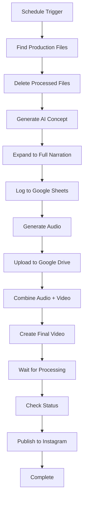

[n8n_workflow_readme.md](https://github.com/user-attachments/files/21936972/n8n_workflow_readme.md)
# 🏍️ Motorcycle Content Automation Workflow

> Automated motorcycle social media content creation pipeline using N8N, AI, and multiple service integrations

[](https://n8n.io/)
[](LICENSE)
[](https://github.com)

## 📋 Table of Contents

- [Overview](#overview)
- [Features](#features)
- [Architecture](#architecture)
- [Prerequisites](#prerequisites)
- [Installation](#installation)
- [Configuration](#configuration)
- [Usage](#usage)
- [Workflow Components](#workflow-components)
- [API Integrations](#api-integrations)
- [Security](#security)
- [Troubleshooting](#troubleshooting)
- [Contributing](#contributing)
- [License](#license)

## 🎯 Overview

This N8N workflow automates the entire process of creating motorcycle-themed social media content, from concept generation to Instagram publishing. The system uses AI to generate ideas, creates voiceovers, combines them with video content, and automatically publishes to Instagram Reels.

### What it does:
1. **🤖 AI Content Generation** - Creates motorcycle-themed video concepts
2. **🎙️ Voice Synthesis** - Generates professional voiceovers using ElevenLabs
3. **🎬 Video Production** - Combines audio with video using Creatomate
4. **📊 Data Logging** - Tracks all content in Google Sheets
5. **📱 Auto Publishing** - Posts directly to Instagram Reels
6. **⏰ Scheduling** - Runs automatically on schedule

## ✨ Features

- **🔄 Fully Automated Pipeline** - From idea to published content
- **🎨 AI-Powered Content Creation** - Google Gemini for creative concepts
- **🎵 Professional Audio** - ElevenLabs voice synthesis
- **📹 Video Processing** - Creatomate template-based video creation
- **📈 Analytics Tracking** - Google Sheets integration for metrics
- **🚀 Social Media Publishing** - Direct Instagram posting via Facebook Graph API
- **⚡ Queue Management** - Smart file processing and organization
- **🛡️ Error Handling** - Robust retry mechanisms and status monitoring

## 🏗️ Architecture



## 📋 Prerequisites

### Required Accounts & Services:
- **N8N Instance** (self-hosted or cloud)
- **Google Account** (Drive, Sheets API access)
- **ElevenLabs Account** (Voice synthesis API)
- **Creatomate Account** (Video creation API)
- **Facebook Developer Account** (Instagram Graph API)
- **Instagram Business Account**

### Technical Requirements:
- N8N version 1.0+
- Node.js 18+ (if self-hosting)
- Valid SSL certificate (for webhooks)

## 🚀 Installation

### 1. Clone Repository
```bash
git clone https://github.com/yourusername/motorcycle-content-automation.git
cd motorcycle-content-automation
```

### 2. Import to N8N
1. Open your N8N instance
2. Go to **Settings** → **Import/Export**
3. Click **Import from File**
4. Upload `workflow.json`
5. Click **Import**

### 3. Install Required N8N Nodes
Ensure these nodes are installed:
- `@n8n/n8n-nodes-langchain` (for AI integration)
- `n8n-nodes-base.googleSheets`
- `n8n-nodes-base.googleDrive`
- `n8n-nodes-base.facebookGraphApi`
- `n8n-nodes-base.httpRequest`

## ⚙️ Configuration

### 1. API Credentials Setup

Create the following credentials in N8N:

#### ElevenLabs API
```
Credential Type: HTTP Bearer Auth
Token: your_elevenlabs_api_key
```

#### Google Services
```
Credential Type: Google OAuth2 API
Scopes: 
- https://www.googleapis.com/auth/drive
- https://www.googleapis.com/auth/spreadsheets
```

#### Facebook Graph API
```
Credential Type: Facebook Graph API
Access Token: your_facebook_access_token
```

#### Creatomate API
```
Credential Type: HTTP Bearer Auth
Token: your_creatomate_api_key
```

### 2. Replace Placeholders

Update the following values in the workflow:

| Placeholder | Description | Where to Find |
|-------------|-------------|---------------|
| `YOUR_VOICE_ID` | ElevenLabs voice identifier | ElevenLabs Dashboard → Voices |
| `YOUR_GOOGLE_SHEETS_DOCUMENT_ID` | Google Sheets document ID | Sheet URL: `docs.google.com/spreadsheets/d/{ID}/edit` |
| `YOUR_PRODUCTION_FOLDER_ID` | Google Drive folder ID | Drive URL: `drive.google.com/drive/folders/{ID}` |
| `YOUR_QUEUE_FOLDER_ID` | Queue folder ID | Drive URL: `drive.google.com/drive/folders/{ID}` |
| `YOUR_AUDIO_FOLDER_ID` | Audio storage folder ID | Drive URL: `drive.google.com/drive/folders/{ID}` |
| `YOUR_CREATOMATE_TEMPLATE_ID` | Video template ID | Creatomate Dashboard → Templates |
| `YOUR_INSTAGRAM_ACCOUNT_ID` | Instagram Business account ID | Facebook Business Manager |

### 3. Google Sheets Setup

Create a Google Sheet with these columns:
- **Caption** - Generated video caption
- **Idea** - Original concept
- **Voice Style** - Audio direction
- **Tags** - Hashtags for posting
- **Status** - Processing status
- **Timestamp** - Creation time

### 4. Creatomate Template

Your Creatomate template should include:
- **Video-DHM.source** - Video input element
- **Voiceover-M7S.source** - Audio input element

## 🎮 Usage

### Manual Execution
1. Place video files in your queue folder (format: `001_filename.mp4`)
2. In N8N, click **Execute Workflow**
3. Monitor progress in the execution log

### Scheduled Execution
The workflow runs automatically daily at 12:00 PM. To modify:
1. Edit the **Schedule Trigger** node
2. Adjust the `triggerAtHour` parameter
3. Save and activate the workflow

### File Naming Convention
Video files should follow this pattern:
```
001_mountain_ride.mp4
002_city_cruise.mp4
003_sunset_journey.mp4
```

## 🔧 Workflow Components

### Core Nodes:

#### 1. **Generate Initial Concept**
- **Purpose**: Creates motorcycle video themes using AI
- **AI Model**: Google Gemini
- **Output**: Single sentence concept

#### 2. **Expand Narration**
- **Purpose**: Develops concept into full script with hashtags
- **AI Model**: Google Gemini with structured output
- **Output**: Complete narration package

#### 3. **Generate Audio**
- **Purpose**: Creates voiceover from script
- **Service**: ElevenLabs TTS
- **Settings**: Multilingual model, 1.2x speed

#### 4. **Video Processing**
- **Purpose**: Combines audio with video
- **Service**: Creatomate
- **Output**: Final Instagram-ready video

#### 5. **Instagram Publishing**
- **Purpose**: Uploads and publishes to Instagram
- **Service**: Facebook Graph API
- **Format**: Instagram Reels

## 🔌 API Integrations

### ElevenLabs Integration
```http
POST https://api.elevenlabs.io/v1/text-to-speech/{voice_id}
Content-Type: application/json
Authorization: Bearer {api_key}

{
  "text": "Your narration text",
  "model_id": "eleven_multilingual_v2",
  "speed": 1.2
}
```

### Creatomate Integration
```http
POST https://api.creatomate.com/v1/renders
Authorization: Bearer {api_key}

{
  "template_id": "{template_id}",
  "modifications": {
    "Video-DHM.source": "{video_url}",
    "Voiceover-M7S.source": "{audio_url}"
  }
}
```

### Instagram Publishing
```http
POST https://graph.facebook.com/v22.0/{ig_account_id}/media
{
  "media_type": "REELS",
  "video_url": "{video_url}",
  "caption": "{caption_with_hashtags}"
}
```

## 🛡️ Security

### Credential Management
- ✅ All API keys stored in N8N credential store
- ✅ No hardcoded secrets in workflow
- ✅ Environment-specific configurations
- ✅ Secure webhook endpoints

### Data Protection
- ✅ Temporary file cleanup
- ✅ Limited API permissions
- ✅ Encrypted credential storage
- ✅ Audit logging enabled

### Best Practices
1. **Rotate API keys** regularly
2. **Limit folder permissions** to necessary scopes only
3. **Monitor API usage** to detect anomalies
4. **Use secure webhooks** with HTTPS
5. **Regular security audits** of integrations

## 🐛 Troubleshooting

### Common Issues

#### "Could not import file" Error
**Cause**: Invalid JSON syntax
**Solution**: Validate JSON format before importing

#### ElevenLabs API Errors
**Cause**: Invalid voice ID or API key
**Solution**: 
```bash
# Test API connection
curl -X GET "https://api.elevenlabs.io/v1/voices" \
  -H "Authorization: Bearer YOUR_API_KEY"
```

#### Video Processing Failures
**Cause**: Unsupported video format or size
**Solution**: 
- Use MP4 format
- Maximum file size: 100MB
- Recommended resolution: 1080x1920 (9:16)

#### Instagram Publishing Issues
**Cause**: Invalid access token or account permissions
**Solution**:
1. Verify Instagram Business account setup
2. Check Facebook App permissions
3. Regenerate access token if expired

### Debug Mode
Enable debug logging in N8N:
```json
{
  "logging": {
    "level": "debug",
    "outputs": ["console", "file"]
  }
}
```

### Monitoring
Monitor these metrics:
- **API call success rates**
- **Processing times**
- **Error frequencies**
- **Content quality scores**

## 🤝 Contributing

We welcome contributions! Please follow these steps:

1. **Fork** the repository
2. **Create** a feature branch (`git checkout -b feature/amazing-feature`)
3. **Commit** your changes (`git commit -m 'Add some amazing feature'`)
4. **Push** to the branch (`git push origin feature/amazing-feature`)
5. **Open** a Pull Request

### Development Guidelines
- Follow N8N workflow best practices
- Include comprehensive error handling
- Document all custom functions
- Test with various content types
- Update README for new features

### Code Style
- Use descriptive node names
- Add comments for complex logic
- Group related nodes visually
- Use consistent naming conventions

## 📄 License

This project is licensed under the MIT License - see the [LICENSE](LICENSE) file for details.

## 🙏 Acknowledgments

- **N8N Team** - For the amazing automation platform
- **ElevenLabs** - For high-quality voice synthesis
- **Creatomate** - For powerful video creation tools
- **Google** - For AI and cloud services
- **Meta** - For Instagram Graph API

## 📞 Support

- **Issues**: [GitHub Issues](https://github.com/yourusername/motorcycle-content-automation/issues)
- **Discussions**: [GitHub Discussions](https://github.com/yourusername/motorcycle-content-automation/discussions)
- **Email**: your.email@example.com

## 🔄 Changelog

### v1.0.0 (2024-08-22)
- ✨ Initial release
- 🤖 AI content generation
- 🎙️ Voice synthesis integration
- 📹 Video processing pipeline
- 📱 Instagram auto-publishing
- 📊 Analytics tracking

---

**⭐ If this project helps you, please consider giving it a star on GitHub!**

Made with ❤️ for the motorcycle community
